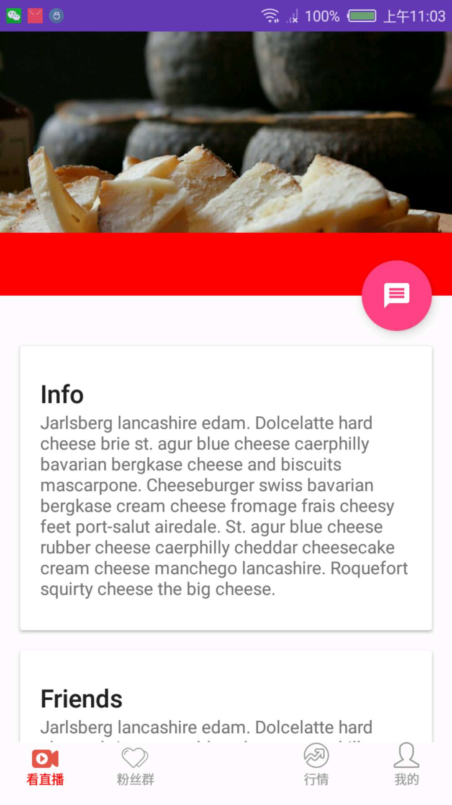
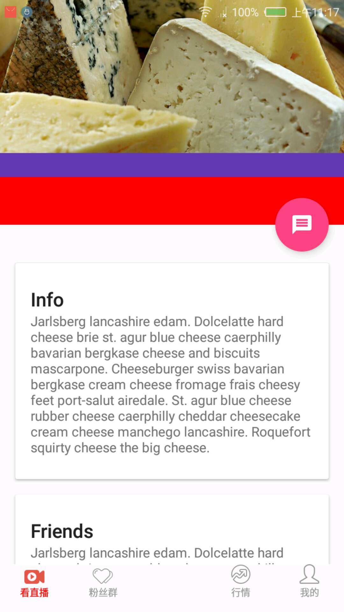

# android-statusBar

如果CoordinatorLayout不加fitsSystemWindows属性，AppBarLayout有这个属性，那么会导致布局无法顶到状态栏下面，而且上面的颜色是白色，导致状态栏看不清楚。CoordinatorLayout加上fitsSystemWindows属性就表示是全屏。

红色区域是我们需要滚动到顶部之后吸顶，而且在顶部的时候上面还是会有状态栏的，也就是说红色区域滚动到顶部，不能被覆盖在状态栏下面。


如果CoordinatorLayout加了fitsSystemWindows属性，但是AppBarLayout没有加的话，会导致AppBarLayout初始的布局是偏移状态栏的高度的距离，然后等到滑动的时候布局可以显示在状态栏下面

 

使用代码控制全屏，实际上这种效果等同于给CoordinatorLayout的fitsSystemWindows属性设置为true

```
if (Build.VERSION.SDK_INT >= Build.VERSION_CODES.LOLLIPOP) {
    getWindow().getDecorView().setSystemUiVisibility(View.SYSTEM_UI_FLAG_LAYOUT_FULLSCREEN | View.SYSTEM_UI_FLAG_LAYOUT_STABLE);
    getWindow().setStatusBarColor(Color.TRANSPARENT);
}
```

如果CoordinatorLayout和AppBarLayout都设置fitsSystemWindows属性为true的话，那么也会有问题，红色区域和顶部的布局区域之前有一个多余的区域就是状态栏高度，背景是设置的主题下的的状态栏背景。




# 参考

- [cheesesquare:Demos the new Android Design library.](https://github.com/chrisbanes/cheesesquare)
- [Android状态栏微技巧，带你真正理解沉浸式模式](https://blog.csdn.net/guolin_blog/article/details/51763825)
- [令人困惑的fitsSystemWindows属性](https://www.jianshu.com/p/5cc3bd23be7b)
- [10fitsSystemWindows对CoordinatorLayout的影响](https://blog.csdn.net/litefish/article/details/52641426)
